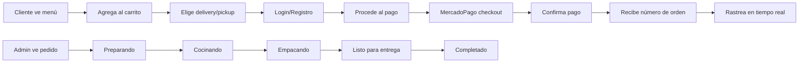

# 🍖 Porkyrios - Sistema de Delivery de Comida con PWA

<div align="center">
  
  
  [](https://web.dev/progressive-web-apps/)
  [](https://nextjs.org/)
  [](https://www.typescriptlang.org/)
  [](https://turso.tech/)
  [](https://sentry.io/)
</div>

---

## 📖 Descripción

**Porkyrios** es un sistema completo de pedidos online para restaurantes especializado en comida mexicana. Ofrece una experiencia de usuario fluida desde la selección de productos hasta el rastreo del pedido en tiempo real.

### ✨ Características Principales

- 🛒 **Carrito de compras inteligente** con persistencia local
- 🍽️ **Menú dinámico** con categorías y productos
- 💳 **Pagos con MercadoPago** integrados
- 🔐 **Autenticación completa** con Better Auth (login/registro)
- 📦 **Sistema de rastreo** de pedidos en tiempo real
- 🏪 **Opciones de entrega**: Delivery (+$35 MXN) o Recoger en local (gratis)
- 🔐 **Panel de administración** protegido con contraseña
- 📊 **Gestión de inventario** en tiempo real
- 📱 **PWA instalable** - funciona offline
- 🌙 **Modo oscuro** incluido
- ⚡ **Carga rápida** con Service Worker
- 🐛 **Error tracking** con Sentry
- 🧪 **Testing coverage** con Vitest y Playwright

---

## 🚀 Inicio Rápido

### Prerequisitos

- **Node.js** 18+ o **Bun** 1.0+
- **Cuenta de Turso** (base de datos SQLite en la nube)
- **Cuenta de MercadoPago** (para pagos)
- **Cuenta de Sentry** (opcional, para error tracking)

### Instalación

```bash
# 1. Clonar el repositorio
git clone https://github.com/tu-usuario/porkyrios.git
cd porkyrios

# 2. Instalar dependencias
npm install
# o
bun install

# 3. Configurar variables de entorno
cp .env.example .env.local
# Editar .env.local con tus credenciales

# 4. Ejecutar migraciones de base de datos
npm run db:push
# o
bun run db:push

# 5. (Opcional) Poblar base de datos con datos de ejemplo
npm run db:seed
# o
bun run db:seed

# 6. Iniciar servidor de desarrollo
npm run dev
# o
bun dev
```

La aplicación estará disponible en `http://localhost:3000`

---

## 🔑 Variables de Entorno

Crea un archivo `.env.local` con las siguientes variables:

```env
# Turso Database
DATABASE_URL=libsql://[tu-database].turso.io
DATABASE_AUTH_TOKEN=[tu-auth-token]

# Better Auth (Autenticación)
BETTER_AUTH_SECRET=[genera-un-secret-aleatorio]
BETTER_AUTH_URL=http://localhost:3000

# MercadoPago (Pagos)
MERCADOPAGO_ACCESS_TOKEN=[tu-access-token]
MERCADOPAGO_PUBLIC_KEY=[tu-public-key]

# Sentry (Error Tracking) - OPCIONAL
NEXT_PUBLIC_SENTRY_DSN=[tu-sentry-dsn]
SENTRY_AUTH_TOKEN=[tu-auth-token]
SENTRY_ORG=[tu-organizacion]
SENTRY_PROJECT=[tu-proyecto]

# Contraseña del panel admin (por defecto: PORKYRIOS2025)
ADMIN_PASSWORD=PORKYRIOS2025

# Configuración de Node
NODE_ENV=development
```

### 📝 Cómo Obtener las Credenciales

#### Turso Database
1. Crea una cuenta gratuita en [turso.tech](https://turso.tech)
2. Crea una nueva base de datos:
   ```bash
   turso db create porkyrios
   ```
3. Obtén la URL y el token:
   ```bash
   turso db show porkyrios --url
   turso db tokens create porkyrios
   ```

#### Better Auth Secret
```bash
# Genera un secret aleatorio seguro
openssl rand -base64 32
```

#### MercadoPago
1. Crea cuenta en [mercadopago.com](https://www.mercadopago.com/)
2. Ve a [Credenciales](https://www.mercadopago.com/developers/panel/credentials)
3. Copia tus credenciales de **TEST** primero para desarrollo
4. Copia tus credenciales de **PRODUCCIÓN** cuando estés listo

#### Sentry (Opcional)
1. Crea cuenta en [sentry.io](https://sentry.io/)
2. Crea un nuevo proyecto Next.js
3. Copia el DSN y credenciales de la configuración

---

## 🗂️ Estructura del Proyecto

```
porkyrios/
├── src/
│   ├── app/                    # Next.js App Router
│   │   ├── admin/              # Panel de administración
│   │   ├── api/                # API Routes
│   │   │   ├── auth/           # Autenticación (Better Auth)
│   │   │   ├── categories/     # CRUD Categorías
│   │   │   ├── products/       # CRUD Productos
│   │   │   ├── orders/         # CRUD Pedidos
│   │   │   ├── payment/        # MercadoPago integration
│   │   │   └── inventory/      # Gestión de stock
│   │   ├── cart/               # Página del carrito
│   │   ├── login/              # Login de usuarios
│   │   ├── register/           # Registro de usuarios
│   │   ├── menu/               # Menú de productos
│   │   ├── payment/            # Pantalla de pago
│   │   └── tracking/           # Rastreo de pedidos
│   ├── components/             # Componentes reutilizables
│   │   └── ui/                 # Componentes de Shadcn/ui
│   ├── contexts/               # React Context (CartContext)
│   ├── db/                     # Configuración de base de datos
│   │   ├── schema.ts           # Esquemas Drizzle ORM
│   │   └── seeds/              # Scripts de datos de ejemplo
│   ├── lib/                    # Utilidades y helpers
│   │   ├── auth.ts             # Configuración Better Auth
│   │   ├── auth-client.ts      # Cliente de autenticación
│   │   ├── payment-service.ts  # Servicio MercadoPago
│   │   └── sentry-utils.ts     # Utilidades Sentry
│   └── test/                   # Tests
│       ├── unit/               # Tests unitarios (Vitest)
│       └── e2e/                # Tests E2E (Playwright)
├── public/                     # Archivos estáticos
│   ├── sw.js                   # Service Worker
│   ├── manifest.json           # PWA Manifest
│   └── icon-*.png              # Iconos PWA
├── drizzle/                    # Migraciones de BD
├── sentry.*.config.ts          # Configuración Sentry
└── middleware.ts               # Middleware de autenticación
```

---

## 🔐 Sistema de Autenticación

Porkyrios usa **Better Auth** para autenticación completa:

### Características
- ✅ Registro de usuarios con email y contraseña
- ✅ Login con validación
- ✅ Sesiones persistentes
- ✅ Middleware de protección de rutas
- ✅ Logout seguro
- ✅ Manejo de errores con toast notifications

### Rutas de Autenticación
- `/login` - Iniciar sesión
- `/register` - Crear cuenta nueva
- `/api/auth/[...all]` - Endpoints de autenticación

### Uso en Componentes
```typescript
import { useSession } from "@/lib/auth-client";

const { data: session, isPending } = useSession();

if (!isPending && !session?.user) {
  // Usuario no autenticado
}
```

**Documentación completa:** Ver [README-AUTH.md](./README-AUTH.md)

---

## 💳 Sistema de Pagos

Integración completa con **MercadoPago**:

### Características
- ✅ Checkout seguro con MercadoPago
- ✅ Múltiples métodos de pago
- ✅ Webhooks para notificaciones
- ✅ URLs de retorno (success/failure/pending)
- ✅ Tracking de pagos por orden

### Flujo de Pago
1. Usuario completa el carrito
2. Se crea una preferencia de pago
3. Redirección a checkout de MercadoPago
4. Usuario completa el pago
5. Webhook actualiza el estado del pedido
6. Usuario regresa a la app con confirmación

### API Endpoints
```typescript
POST /api/payment/preference    # Crear preferencia de pago
POST /api/payment/webhook       # Recibir notificaciones
```

**Documentación completa:** Ver [README-PAYMENTS.md](./README-PAYMENTS.md)

---

## 🐛 Error Tracking con Sentry

Sentry está integrado para monitorear errores en producción:

### Características
- ✅ Captura automática de errores
- ✅ Session replay en errores
- ✅ Performance monitoring
- ✅ Breadcrumbs para debugging
- ✅ Error boundaries en rutas críticas

### Configuración
1. Crea cuenta en [sentry.io](https://sentry.io/)
2. Crea proyecto Next.js
3. Agrega credenciales al `.env.local`
4. ¡Listo! Los errores se enviarán automáticamente

### Archivos de Configuración
- `sentry.client.config.ts` - Cliente
- `sentry.server.config.ts` - Servidor
- `sentry.edge.config.ts` - Edge runtime
- `src/lib/sentry-utils.ts` - Utilidades helper

**Documentación completa:** Ver [README-SENTRY.md](./README-SENTRY.md)

---

## 📱 Características PWA

Porkyrios es una **Progressive Web App** instalable:

### Instalación

- **Desktop**: Clic en el ícono (+) en la barra de URL
- **Android**: Banner "¡Instala Porkyrios!" → "Instalar App"
- **iOS**: Safari → Compartir → "Agregar a pantalla de inicio"

### Funcionalidades Offline

- ✅ Páginas cacheadas automáticamente
- ✅ Funciona sin conexión
- ✅ Actualizaciones automáticas del Service Worker
- ✅ Splash screen personalizado

---

## 🔐 Panel de Administración

Accede al panel en `/admin` con la contraseña configurada (por defecto: `PORKYRIOS2025`)

### Accesos Secretos
- **Triple click en logo** de homepage
- **Konami Code** (↑↑↓↓←→←→) en homepage

### Funcionalidades Admin

#### 📊 Dashboard
- Vista general de pedidos del día
- Ingresos totales
- Pedidos en preparación
- Pedidos completados

#### 🍽️ Gestión de Productos
- Crear, editar y eliminar productos
- Gestionar stock y precios
- Activar/desactivar productos
- Asignar categorías
- Alertas de stock bajo

#### 📁 Gestión de Categorías
- Crear categorías con emojis
- Activar/desactivar categorías
- Ver productos por categoría
- Eliminar categorías vacías

#### 📦 Gestión de Pedidos
- Ver todos los pedidos en tiempo real
- Actualizar estados:
  - 🟡 Preparando
  - 🟠 Cocinando
  - 🔵 Empacando
  - 🟢 Listo
  - ✅ Completado
  - ❌ Cancelado
- Filtrar por estado
- Ver detalles de clientes

---

## 🧪 Testing

Sistema de testing completo con **Vitest** (unitarios) y **Playwright** (E2E):

### Tests Unitarios
```bash
# Ejecutar todos los tests
npm run test

# Ejecutar con coverage
npm run test:coverage

# Ejecutar en modo watch
npm run test:watch
```

### Tests E2E
```bash
# Ejecutar tests de Playwright
npm run test:e2e

# Modo UI interactivo
npm run test:e2e:ui

# Solo Chrome
npm run test:e2e:chrome
```

### Coverage Actual
- ✅ CartContext - 30+ tests
- ✅ MenuPage - 26+ tests
- ✅ CartPage - 40+ tests
- ⚠️ PaymentPage - En progreso

**Documentación completa:** Ver [TESTING-COVERAGE-COMPLETADO.md](./TESTING-COVERAGE-COMPLETADO.md)

---

## 🛠️ Scripts Disponibles

```bash
# Desarrollo
npm run dev              # Iniciar servidor de desarrollo
npm run build            # Build de producción
npm run start            # Iniciar servidor de producción
npm run lint             # Ejecutar ESLint

# Base de Datos
npm run db:push          # Aplicar cambios de schema a BD
npm run db:studio        # Abrir Drizzle Studio (GUI)
npm run db:seed          # Poblar BD con datos de ejemplo

# Testing
npm run test             # Tests unitarios (Vitest)
npm run test:coverage    # Tests con coverage
npm run test:e2e         # Tests E2E (Playwright)

# PWA
npm run generate:icons   # Generar iconos PWA
```

---

## 🌐 API Endpoints

### Autenticación (Better Auth)

```typescript
POST   /api/auth/sign-up           # Registro
POST   /api/auth/sign-in           # Login
POST   /api/auth/sign-out          # Logout
GET    /api/auth/get-session       # Obtener sesión
```

### Categorías

```typescript
GET    /api/categories              # Listar todas
GET    /api/categories?limit=10     # Con límite
POST   /api/categories              # Crear nueva
PUT    /api/categories?id=1         # Actualizar
DELETE /api/categories?id=1         # Eliminar
```

### Productos

```typescript
GET    /api/products                # Listar todos
GET    /api/products?limit=10       # Con límite
GET    /api/products?categoryId=1   # Por categoría
POST   /api/products                # Crear nuevo
PUT    /api/products?id=1           # Actualizar
DELETE /api/products?id=1           # Eliminar
```

### Pedidos

```typescript
GET    /api/orders                  # Listar todos
GET    /api/orders?limit=10         # Con límite
GET    /api/orders?status=cooking   # Por estado
GET    /api/orders?orderNumber=P001 # Por número de orden
POST   /api/orders                  # Crear nuevo
PUT    /api/orders?id=1             # Actualizar estado
DELETE /api/orders?id=1             # Eliminar
```

### Pagos (MercadoPago)

```typescript
POST   /api/payment/preference      # Crear preferencia
POST   /api/payment/webhook         # Webhook notificaciones
```

### Inventario

```typescript
GET    /api/inventory               # Estado del inventario
GET    /api/inventory?productId=1   # Stock de producto
PUT    /api/inventory?productId=1   # Actualizar stock
```

**Documentación completa:** Ver [docs/API.md](./docs/API.md)

---

## 🎨 Tecnologías Utilizadas

### Frontend
- **Next.js 15** - Framework React con App Router
- **TypeScript** - Tipado estático
- **Tailwind CSS** - Estilos utility-first
- **Shadcn/ui** - Componentes accesibles
- **Lucide React** - Iconos
- **Sonner** - Notificaciones toast
- **Framer Motion** - Animaciones

### Backend
- **Next.js API Routes** - Backend serverless
- **Drizzle ORM** - Type-safe ORM
- **Turso** - Base de datos SQLite edge
- **Better Auth** - Sistema de autenticación

### Pagos & Monitoreo
- **MercadoPago SDK** - Procesamiento de pagos
- **Sentry** - Error tracking y performance monitoring

### PWA
- **Workbox** - Service Worker
- **Web App Manifest** - Metadatos de instalación

### Testing
- **Vitest** - Tests unitarios
- **Playwright** - Tests E2E
- **Testing Library** - Testing utilities

---

## 📦 Flujo de Pedidos



---

## 🚢 Despliegue

### Vercel (Recomendado)

#### ⚡ Verificación Pre-Deploy
```bash
# Ejecutar checklist automático
bash scripts/pre-deploy-check.sh

# O verificar manualmente
npm run build
npm run test:run
```

#### 🚀 Deploy Rápido
```bash
# 1. Push a GitHub
git add .
git commit -m "feat: ready for production deployment"
git push origin main

# 2. Importar en Vercel
# Ve a https://vercel.com/new
# Importa tu repositorio
# Configura variables de entorno
# Click en "Deploy"
```

#### 🔑 Variables de Entorno en Vercel

**CRÍTICAS (obligatorias):**
- `DATABASE_URL` - Turso Database
- `DATABASE_AUTH_TOKEN` - Turso Token
- `ADMIN_PASSWORD` - Contraseña admin

**RECOMENDADAS:**
- `NEXT_PUBLIC_SENTRY_DSN` - Error tracking
- `SENTRY_AUTH_TOKEN` - Releases
- `SENTRY_ORG` & `SENTRY_PROJECT` - Organización
- `RESEND_API_KEY` - Email notifications

**PRODUCCIÓN:**
- `NODE_ENV=production`
- `NEXT_PUBLIC_APP_URL=https://tu-dominio.vercel.app`

#### 📚 Guías Detalladas
- **Checklist rápido:** [DEPLOY-CHECKLIST.md](./DEPLOY-CHECKLIST.md)
- **Guía completa:** [DEPLOYMENT-GUIDE.md](./DEPLOYMENT-GUIDE.md)

### Otras Plataformas

- **Netlify**: Compatible con Next.js
- **Cloudflare Pages**: Requiere adaptador
- **Railway**: Soporte nativo para Next.js

**Guía completa de deployment:** Ver [docs/DEPLOYMENT.md](./docs/DEPLOYMENT.md)

---

## 📚 Documentación

- **DEPLOYMENT-GUIDE.md** - Guía completa de deployment en Vercel
- **DEPLOY-CHECKLIST.md** - Checklist rápido pre/post-deploy
- **TEMPLATE-SETUP.md** - Usar Porkyrios como template para nuevos proyectos
- **PWA-README.md** - Documentación de Progressive Web App
- **README-SENTRY.md** - Configuración de monitoreo con Sentry
- **CONTRIBUTING.md** - Guía de contribución
- **CHANGELOG.md** - Historial de cambios

---

## 🎯 Usar como Template

¿Quieres usar Porkyrios como base para tu propio proyecto? ¡Es fácil!

### Opción 1: GitHub Template (Recomendado)

1. **Convierte este repo en template**:
   - Settings → General → ✅ Template repository

2. **Crea nuevo proyecto**:
   - Click "Use this template" → "Create a new repository"
   - Dale un nombre a tu proyecto
   - Clone y ejecuta: `bash scripts/template-setup.sh`

3. **Personaliza**:
   - El script actualizará package.json, README, etc.
   - Configura nuevas credenciales en .env
   - ¡Listo para desarrollar!

### Opción 2: Clone Manual

```bash
# Copiar proyecto
cp -r porkyrios mi-nuevo-proyecto
cd mi-nuevo-proyecto

# Limpiar git
rm -rf .git
git init

# Setup automático
bash scripts/template-setup.sh

# Instalar
bun install
```

**📖 Guía completa:** Ver **TEMPLATE-SETUP.md**

---

## 🔒 Seguridad

- ✅ Autenticación con Better Auth
- ✅ Sesiones seguras con tokens
- ✅ Panel admin protegido con contraseña
- ✅ Validación de datos en cliente y servidor
- ✅ Sanitización de inputs
- ✅ Rate limiting en APIs (recomendado para producción)
- ✅ HTTPS obligatorio en producción
- ✅ Error tracking con Sentry
- ✅ Middleware de protección de rutas

---

## 🤝 Contribuir

¡Las contribuciones son bienvenidas!

1. Fork el proyecto
2. Crea una rama para tu feature (`git checkout -b feature/AmazingFeature`)
3. Commit tus cambios (`git commit -m 'Add some AmazingFeature'`)
4. Push a la rama (`git push origin feature/AmazingFeature`)
5. Abre un Pull Request

Ver [CONTRIBUTING.md](./CONTRIBUTING.md) para más detalles.

---

## 📄 Licencia

Este proyecto está bajo la Licencia MIT - ver el archivo [LICENSE](LICENSE) para más detalles.

---

## 📞 Soporte

- 📧 Email: soporte@porkyrios.com
- 🐛 Issues: [GitHub Issues](https://github.com/tu-usuario/porkyrios/issues)
- 📖 Docs: [Documentación](./docs)

---

## 🙏 Créditos

Desarrollado con ❤️ por el equipo de Porkyrios

**Tecnologías principales:**
- [Next.js](https://nextjs.org/)
- [Turso](https://turso.tech/)
- [Drizzle ORM](https://orm.drizzle.team/)
- [Shadcn/ui](https://ui.shadcn.com/)
- [Better Auth](https://www.better-auth.com/)
- [MercadoPago](https://www.mercadopago.com/)
- [Sentry](https://sentry.io/)

---

## 📋 Checklist de Configuración

Antes de usar en producción, verifica:

- [ ] Base de datos Turso configurada y migraciones aplicadas
- [ ] Better Auth secret generado y configurado
- [ ] MercadoPago credenciales de PRODUCCIÓN configuradas
- [ ] Sentry DSN y credenciales configuradas (opcional)
- [ ] Contraseña de admin personalizada
- [ ] Variables de entorno en plataforma de deployment
- [ ] HTTPS habilitado
- [ ] PWA manifest configurado con datos correctos
- [ ] Testing ejecutado y pasando
- [ ] Webhooks de MercadoPago configurados

---

## ⚙️ Límites Técnicos

### 📊 Límites del Sistema

| Componente | Límite Actual | Notas |
|------------|---------------|-------|
| **Productos en Panel Admin** | 100 productos | Se cargan todos en sección "Promos" para gestionar destacados |
| **Productos Destacados (Homepage)** | Máximo 3 mostrados | Solo los 3 primeros con `featured: true` |
| **Consultas API** | 100 registros/query | Endpoints con `?limit=100` por defecto |
| **Categorías** | Sin límite técnico | Rendimiento óptimo hasta ~50 categorías |
| **Pedidos en Admin** | 100 pedidos/carga | Usar filtros por estado para grandes volúmenes |
| **Stock de Productos** | 999,999 unidades | Campo `INTEGER` en base de datos |
| **Tamaño de Imagen** | 5 MB | Validado en upload de productos/categorías |

### 🔍 Detalles de Implementación

#### Productos en Sección "Promos"
```typescript
// src/app/admin/page.tsx
const fetchProducts = async () => {
  const response = await fetch("/api/products?limit=100");
  const data = await response.json();
  setProducts(data); // Se cargan TODOS (hasta 100)
};
```

**Razón del diseño:**
- Permite al admin ver **todos los productos** en una sola vista
- Facilita marcar/desmarcar productos destacados con un clic
- Óptimo hasta 100 productos (suficiente para la mayoría de restaurantes)

#### ¿Qué pasa con +100 productos?
Si tu negocio crece y necesitas más de 100 productos:

**Opción 1: Aumentar el límite**
```typescript
// Cambiar en src/app/admin/page.tsx
fetch("/api/products?limit=200") // o el número necesario
```

**Opción 2: Implementar paginación**
```typescript
// Agregar controles de página
const [page, setPage] = useState(1);
fetch(`/api/products?limit=50&offset=${(page - 1) * 50}`);
```

**Opción 3: Agregar búsqueda**
```typescript
// Filtro de búsqueda en tiempo real
const [search, setSearch] = useState("");
const filtered = products.filter(p => 
  p.name.toLowerCase().includes(search.toLowerCase())
);
```

### 📈 Escalabilidad

#### Rendimiento Esperado

| Escenario | Usuarios Concurrentes | Rendimiento |
|-----------|----------------------|-------------|
| Restaurante pequeño | < 50 | ⚡ Excelente |
| Restaurante mediano | 50-200 | ✅ Óptimo |
| Restaurante grande | 200-500 | ✅ Bueno con CDN |
| Cadena de restaurantes | 500+ | ⚠️ Requiere optimizaciones* |

**(*) Optimizaciones recomendadas para alto tráfico:**
- Implementar Redis para cache
- CDN para assets estáticos
- Load balancing
- Separar base de datos de lectura/escritura

### 🚀 Mejoras Futuras

Si necesitas escalar más allá de los límites actuales:

1. **Paginación en Admin**: Dividir productos en páginas de 50
2. **Búsqueda avanzada**: Filtrar por nombre, categoría, stock
3. **Lazy loading**: Cargar productos bajo demanda
4. **Infinite scroll**: En lugar de paginación tradicional
5. **Virtual scrolling**: Para listas muy largas (1000+ items)

### 💡 Recomendaciones

#### Para Restaurantes Pequeños (< 50 productos)
✅ Configuración actual es **perfecta**  
✅ No requiere cambios

#### Para Restaurantes Medianos (50-100 productos)
✅ Configuración actual es **óptima**  
💡 Considera agregar búsqueda si navegación es lenta

#### Para Restaurantes Grandes (100+ productos)
⚠️ Aumenta `limit` a 150-200  
⚠️ Implementa búsqueda/filtros en admin  
⚠️ Considera paginación

#### Para Cadenas (200+ productos)
🔧 Refactoriza con paginación obligatoria  
🔧 Implementa cache con Redis  
🔧 Usa CDN para assets  
🔧 Considera microservicios

---

<div align="center">
  <strong>¡Disfruta Porkyrios! 🍖</strong>
  <br />
  <sub>Hecho en México 🇲🇽</sub>
</div>