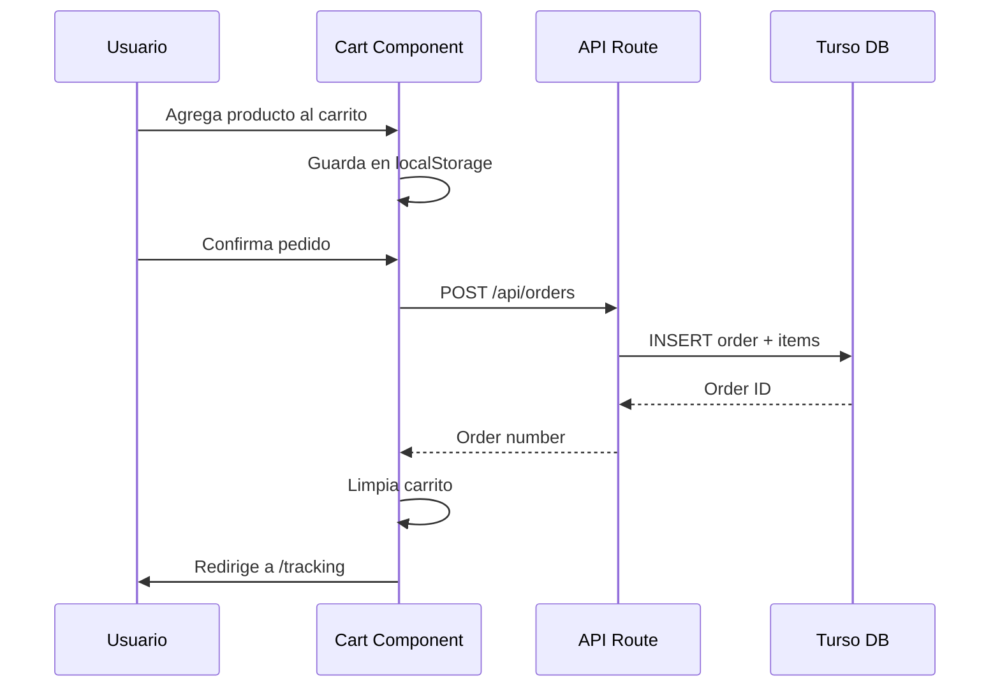
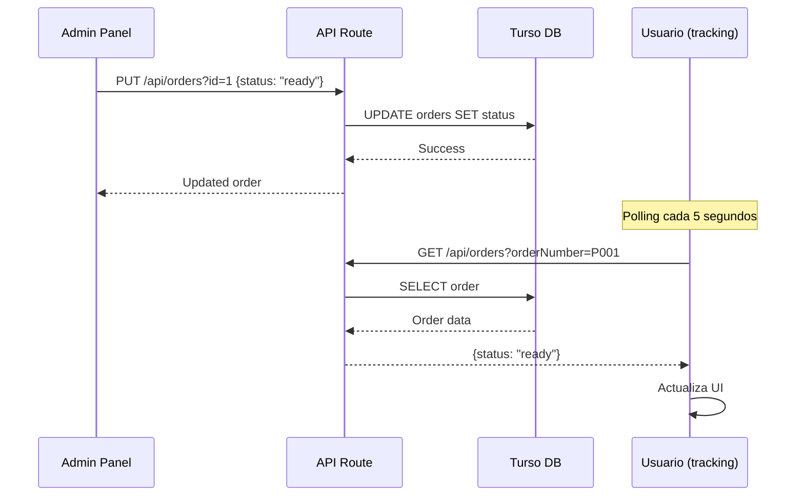
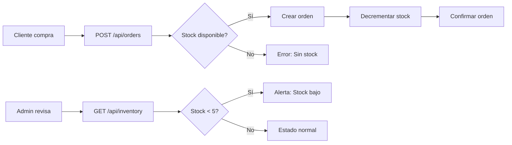

# 🏗️ Arquitectura del Sistema - Porkyrios

Documentación técnica de la arquitectura de Porkyrios.

---

## 📋 Tabla de Contenidos

1. [Visión General](#visión-general)
2. [Stack Tecnológico](#stack-tecnológico)
3. [Arquitectura de Componentes](#arquitectura-de-componentes)
4. [Flujo de Datos](#flujo-de-datos)
5. [Modelo de Base de Datos](#modelo-de-base-de-datos)
6. [Patrones de Diseño](#patrones-de-diseño)
7. [Consideraciones de Escalabilidad](#consideraciones-de-escalabilidad)

---

## 🔍 Visión General

Porkyrios es una **Progressive Web App (PWA)** construida con Next.js 15, utilizando el paradigma de **App Router** con React Server Components y Client Components según sea necesario.

### Arquitectura High-Level

```
┌─────────────────────────────────────────────────────────────┐
│                        Cliente (PWA)                         │
│  ┌────────────┐  ┌────────────┐  ┌────────────┐            │
│  │  Homepage  │  │    Menú    │  │  Carrito   │            │
│  └────────────┘  └────────────┘  └────────────┘            │
│  ┌────────────┐  ┌────────────┐  ┌────────────┐            │
│  │   Pago     │  │  Tracking  │  │   Admin    │            │
│  └────────────┘  └────────────┘  └────────────┘            │
└─────────────────────────────────────────────────────────────┘
                            ↕️
┌─────────────────────────────────────────────────────────────┐
│                    Next.js Backend (Edge)                    │
│  ┌──────────────────────────────────────────────────────┐   │
│  │              API Routes (Serverless)                  │   │
│  │  ┌──────────┐ ┌──────────┐ ┌──────────┐ ┌─────────┐ │   │
│  │  │Categories│ │ Products │ │  Orders  │ │Inventory│ │   │
│  │  └──────────┘ └──────────┘ └──────────┘ └─────────┘ │   │
│  └──────────────────────────────────────────────────────┘   │
└─────────────────────────────────────────────────────────────┘
                            ↕️
┌─────────────────────────────────────────────────────────────┐
│                  Turso Database (SQLite Edge)                │
│  ┌─────────┐  ┌─────────┐  ┌─────────┐  ┌──────────────┐   │
│  │Category │  │ Product │  │  Order  │  │  OrderItem   │   │
│  └─────────┘  └─────────┘  └─────────┘  └──────────────┘   │
└─────────────────────────────────────────────────────────────┘
```

---

## 💻 Stack Tecnológico

### Frontend

| Tecnología | Versión | Propósito |
|------------|---------|-----------|
| **Next.js** | 15.1.6 | Framework React con SSR/SSG |
| **React** | 19.0.0 | Librería UI |
| **TypeScript** | 5.7.3 | Tipado estático |
| **Tailwind CSS** | 4.0.0 | Estilos utility-first |
| **Shadcn/ui** | Latest | Componentes accesibles |
| **Lucide React** | Latest | Iconos |
| **Sonner** | Latest | Notificaciones toast |

### Backend

| Tecnología | Versión | Propósito |
|------------|---------|-----------|
| **Next.js API Routes** | 15.1.6 | Backend serverless |
| **Drizzle ORM** | 0.38.3 | Type-safe ORM |
| **Turso** | Latest | Base de datos SQLite edge |

### PWA

| Tecnología | Propósito |
|------------|-----------|
| **Service Worker** | Caché offline |
| **Web App Manifest** | Instalación nativa |

---

## 🧩 Arquitectura de Componentes

### Estructura de Directorios

```
src/
├── app/                        # Next.js App Router
│   ├── layout.tsx              # Layout raíz (Server Component)
│   ├── page.tsx                # Homepage (Server Component)
│   ├── admin/
│   │   └── page.tsx            # Panel admin (Client Component)
│   ├── api/                    # API Routes
│   │   ├── categories/
│   │   │   └── route.ts        # CRUD Categorías
│   │   ├── products/
│   │   │   └── route.ts        # CRUD Productos
│   │   ├── orders/
│   │   │   ├── route.ts        # CRUD Pedidos
│   │   │   └── items/
│   │   │       └── route.ts    # Items de pedidos
│   │   └── inventory/
│   │       └── route.ts        # Gestión de stock
│   ├── cart/
│   │   └── page.tsx            # Carrito (Client Component)
│   ├── menu/
│   │   └── page.tsx            # Menú (Client Component)
│   ├── payment/
│   │   └── page.tsx            # Pago (Client Component)
│   └── tracking/
│       └── page.tsx            # Rastreo (Client Component)
├── components/
│   ├── ui/                     # Shadcn/ui components
│   └── ...                     # Custom components
├── contexts/
│   └── CartContext.tsx         # Context API para carrito
├── db/
│   ├── index.ts                # Conexión DB
│   ├── schema.ts               # Esquemas Drizzle
│   └── seeds/                  # Scripts de datos
└── lib/
    └── utils.ts                # Utilidades
```

### Tipos de Componentes

#### Server Components (por defecto)
- `app/layout.tsx`
- `app/page.tsx`

**Características:**
- Renderizado en servidor
- Acceso directo a base de datos
- No usan hooks de React
- Mejor SEO

#### Client Components ("use client")
- `app/admin/page.tsx`
- `app/cart/page.tsx`
- `app/menu/page.tsx`
- `contexts/CartContext.tsx`

**Características:**
- Interactividad (useState, useEffect)
- Acceso a Web APIs (localStorage, etc.)
- Event handlers
- React Context

---

## 🔄 Flujo de Datos

### 1. Pedido Cliente → Backend → DB



### 2. Admin Actualiza Estado



### 3. Gestión de Inventario



---

## 🗄️ Modelo de Base de Datos

### Esquema ERD

```
┌─────────────────┐         ┌─────────────────┐
│    Category     │         │     Product     │
├─────────────────┤         ├─────────────────┤
│ id (PK)         │◄───┐    │ id (PK)         │
│ name            │    │    │ name            │
│ emoji           │    │    │ description     │
│ active          │    └────┤ categoryId (FK) │
│ createdAt       │         │ price           │
└─────────────────┘         │ stock           │
                            │ image           │
                            │ active          │
                            │ createdAt       │
                            └─────────────────┘
                                     ▲
                                     │
                                     │
┌─────────────────┐         ┌───────┴─────────┐
│      Order      │         │    OrderItem    │
├─────────────────┤         ├─────────────────┤
│ id (PK)         │◄────────┤ id (PK)         │
│ orderNumber     │         │ orderId (FK)    │
│ customerName    │         │ productId (FK)  │
│ phone           │         │ quantity        │
│ total           │         │ price           │
│ status          │         │ productName     │
│ createdAt       │         └─────────────────┘
│ updatedAt       │
└─────────────────┘
```

### Definiciones de Tablas

#### Category

```typescript
export const category = sqliteTable("category", {
  id: integer("id").primaryKey({ autoIncrement: true }),
  name: text("name").notNull(),
  emoji: text("emoji").notNull(),
  active: integer("active", { mode: "boolean" }).notNull().default(true),
  createdAt: text("created_at").notNull().default(sql`CURRENT_TIMESTAMP`),
});
```

**Índices:**
- PRIMARY KEY: `id`
- UNIQUE: `name`

---

#### Product

```typescript
export const product = sqliteTable("product", {
  id: integer("id").primaryKey({ autoIncrement: true }),
  name: text("name").notNull(),
  description: text("description"),
  price: real("price").notNull(),
  categoryId: integer("category_id").references(() => category.id),
  stock: integer("stock").notNull().default(0),
  image: text("image"),
  active: integer("active", { mode: "boolean" }).notNull().default(true),
  createdAt: text("created_at").notNull().default(sql`CURRENT_TIMESTAMP`),
});
```

**Índices:**
- PRIMARY KEY: `id`
- FOREIGN KEY: `categoryId` → `category.id`
- INDEX: `categoryId`, `active`

---

#### Order

```typescript
export const order = sqliteTable("order", {
  id: integer("id").primaryKey({ autoIncrement: true }),
  orderNumber: text("order_number").notNull().unique(),
  customerName: text("customer_name").notNull(),
  phone: text("phone").notNull(),
  total: real("total").notNull(),
  status: text("status").notNull().default("preparing"),
  createdAt: text("created_at").notNull().default(sql`CURRENT_TIMESTAMP`),
  updatedAt: text("updated_at").notNull().default(sql`CURRENT_TIMESTAMP`),
});
```

**Estados válidos:**
- `preparing`, `cooking`, `packing`, `ready`, `completed`, `cancelled`

**Índices:**
- PRIMARY KEY: `id`
- UNIQUE: `orderNumber`
- INDEX: `status`, `createdAt`

---

#### OrderItem

```typescript
export const orderItem = sqliteTable("order_item", {
  id: integer("id").primaryKey({ autoIncrement: true }),
  orderId: integer("order_id").notNull().references(() => order.id, { onDelete: "cascade" }),
  productId: integer("product_id").notNull().references(() => product.id),
  quantity: integer("quantity").notNull(),
  price: real("price").notNull(),
  productName: text("product_name").notNull(),
});
```

**Relaciones:**
- FOREIGN KEY: `orderId` → `order.id` (CASCADE DELETE)
- FOREIGN KEY: `productId` → `product.id`

---

## 🎨 Patrones de Diseño

### 1. Context API (Estado Global)

**Uso**: Carrito de compras

```typescript
// contexts/CartContext.tsx
export const CartProvider = ({ children }) => {
  const [cart, setCart] = useState<CartItem[]>([]);
  const [deliveryMethod, setDeliveryMethod] = useState<"delivery" | "pickup">("delivery");

  // Persistencia en localStorage
  useEffect(() => {
    localStorage.setItem("cart", JSON.stringify(cart));
  }, [cart]);

  return (
    <CartContext.Provider value={{ cart, addItem, removeItem, ... }}>
      {children}
    </CartContext.Provider>
  );
};
```

**Ventajas:**
- Estado compartido entre componentes
- No requiere prop drilling
- Fácil de testear

---

### 2. API Route Handler Pattern

**Uso**: Todos los endpoints

```typescript
// app/api/products/route.ts
export async function GET(request: Request) {
  try {
    const { searchParams } = new URL(request.url);
    const limit = parseInt(searchParams.get("limit") || "100");
    
    const products = await db.select()
      .from(productTable)
      .limit(limit);
    
    return Response.json(products);
  } catch (error) {
    return Response.json(
      { error: "Failed to fetch products" },
      { status: 500 }
    );
  }
}
```

**Ventajas:**
- Separación de lógica backend
- Type-safe con TypeScript
- Easy error handling

---

### 3. Client-Side Polling

**Uso**: Rastreo de pedidos en tiempo real

```typescript
useEffect(() => {
  const interval = setInterval(() => {
    fetchOrderStatus();
  }, 5000); // Poll cada 5 segundos

  return () => clearInterval(interval);
}, [orderNumber]);
```

**Alternativas futuras:**
- WebSockets para tiempo real
- Server-Sent Events (SSE)

---

### 4. Optimistic Updates

**Uso**: Admin panel (actualización de estados)

```typescript
const handleUpdateStatus = async (id: number, newStatus: string) => {
  // Actualizar UI inmediatamente
  setOrders(orders.map(o => 
    o.id === id ? { ...o, status: newStatus } : o
  ));

  try {
    // Persistir en backend
    await fetch(`/api/orders?id=${id}`, {
      method: "PUT",
      body: JSON.stringify({ status: newStatus })
    });
  } catch (error) {
    // Revertir en caso de error
    setOrders(prevOrders);
    toast.error("Error al actualizar");
  }
};
```

---

## 📈 Consideraciones de Escalabilidad

### Performance Optimizations

#### 1. Image Optimization

```typescript
// Usar Next.js Image component
import Image from "next/image";

<Image
  src="/products/taco.jpg"
  alt="Taco"
  width={300}
  height={300}
  loading="lazy"
/>
```

#### 2. Code Splitting

```typescript
// Lazy loading de componentes pesados
const AdminPanel = dynamic(() => import("./admin/page"), {
  loading: () => <LoadingSpinner />,
  ssr: false
});
```

#### 3. API Caching

```typescript
// Caché en edge con Next.js
export const revalidate = 60; // Revalidar cada 60 segundos

export async function GET() {
  const products = await db.select().from(productTable);
  return Response.json(products);
}
```

#### 4. Database Indexing

```sql
-- Índices para consultas comunes
CREATE INDEX idx_product_category ON product(category_id);
CREATE INDEX idx_product_active ON product(active);
CREATE INDEX idx_order_status ON "order"(status);
CREATE INDEX idx_order_created ON "order"(created_at);
```

---

### Escalabilidad Horizontal

#### 1. Separar Admin y Client

```
┌──────────────┐        ┌──────────────┐
│  Client App  │        │  Admin App   │
│  (Public)    │        │  (Private)   │
└──────────────┘        └──────────────┘
        ↓                       ↓
    ┌─────────────────────────────┐
    │     Shared API Layer         │
    └─────────────────────────────┘
                ↓
        ┌──────────────┐
        │   Database   │
        └──────────────┘
```

#### 2. Microservicios (Futuro)

```
┌─────────────┐  ┌─────────────┐  ┌─────────────┐
│   Orders    │  │  Products   │  │   Users     │
│   Service   │  │   Service   │  │   Service   │
└─────────────┘  └─────────────┘  └─────────────┘
       ↓                ↓                ↓
   ┌────────────────────────────────────────┐
   │         Message Queue (Redis)          │
   └────────────────────────────────────────┘
```

#### 3. CDN para Assets

- Usar Vercel Edge Network o Cloudflare
- Servir imágenes desde CDN
- Caché de API en edge

---

### Limitaciones Actuales

| Aspecto | Actual | Límite | Solución Futura |
|---------|--------|--------|-----------------|
| **Concurrencia** | ~100 usuarios | Límite de Turso free tier | Upgrade a plan Pro |
| **Base de datos** | 1 instancia | Single point of failure | Replicas read |
| **Real-time** | Polling | Latencia de 5s | WebSockets |
| **Auth** | Password simple | No multi-user | JWT + roles |
| **Payments** | Mock | No procesamiento | Stripe/MercadoPago |

---

## 🔒 Seguridad

### Implementado

✅ Input validation en cliente y servidor  
✅ SQL injection protection (Drizzle ORM)  
✅ XSS protection (React escaping)  
✅ HTTPS en producción  
✅ Environment variables para secrets  

### Recomendaciones Futuras

- [ ] Rate limiting en APIs
- [ ] CSRF tokens
- [ ] JWT authentication para admin
- [ ] Role-based access control (RBAC)
- [ ] Audit logging

---

<div align="center">
  <strong>Arquitectura diseñada para escalar 📈</strong>
  <br />
  <sub>Porkyrios - Documentación Técnica</sub>
</div>
